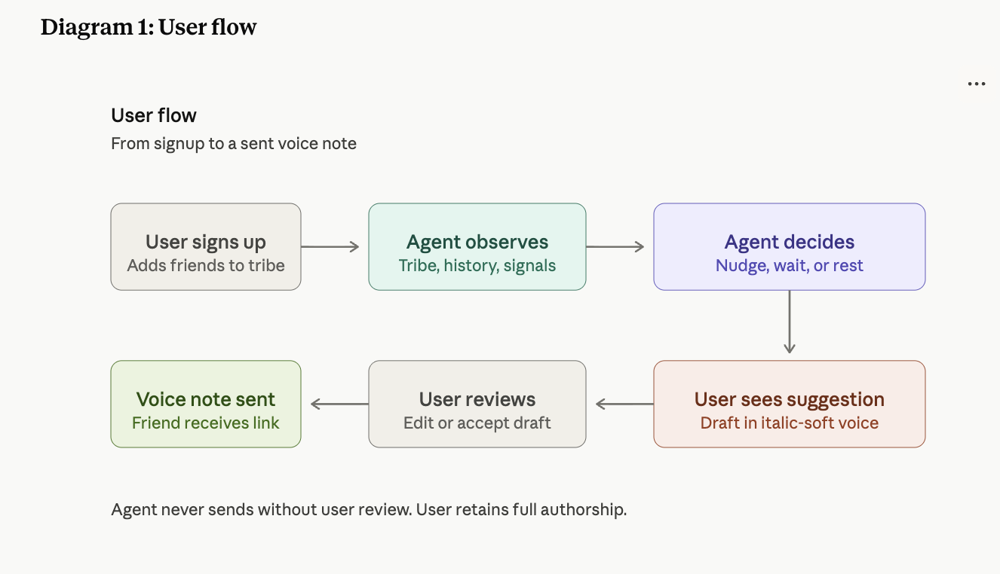
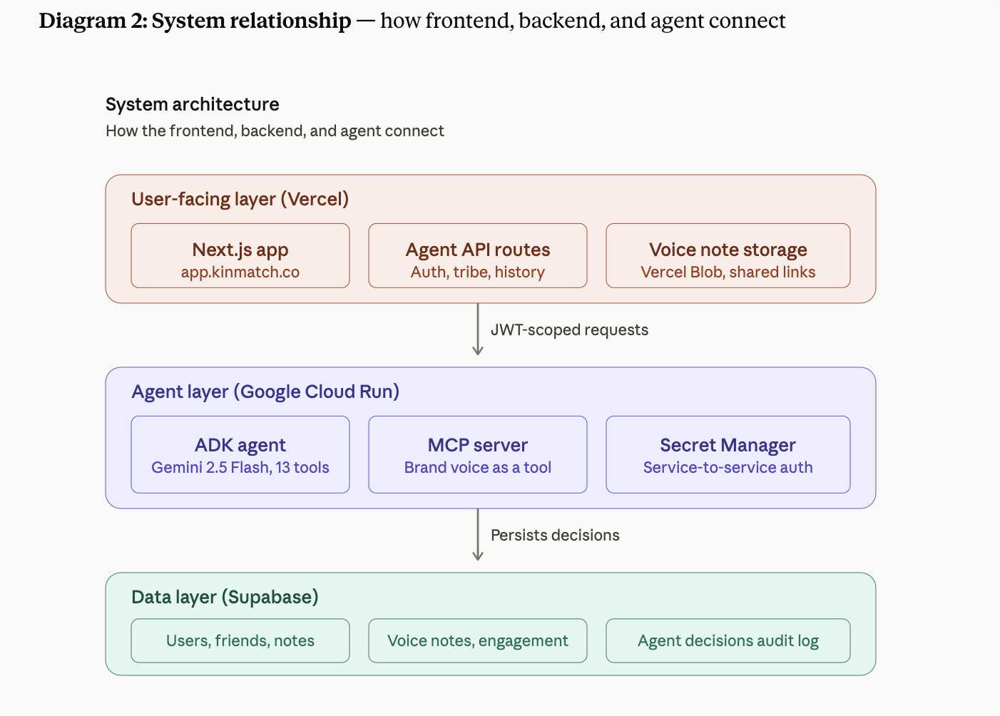
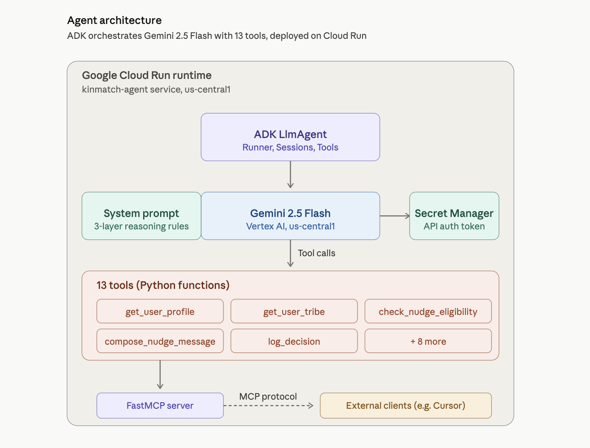

# 🏗️ Architecture — KinMatch Relational Care Agent

> Deep-dive into the system design, component responsibilities, and key decisions behind KinMatch's autonomous AI agent — built for the Google for Startups AI Agents Challenge.

---

## Table of Contents

1. [Overview](#1-overview)
2. [Mandatory Tech Requirements](#2-mandatory-tech-requirements)
3. [User Flow](#3-user-flow)
4. [System Architecture](#4-system-architecture)
5. [Agent Architecture](#5-agent-architecture)
6. [Three-Layer Reasoning](#6-three-layer-reasoning)
7. [Data Flow](#7-data-flow)
8. [Deployment](#8-deployment)
9. [Tech Stack Summary](#9-tech-stack-summary)
10. [Key Design Decisions](#10-key-design-decisions)

---

## 1. Overview

KinMatch is a voice-first friendship app for working adults — people between 30s to 50s who deeply care about their close friends but lose touch as work, family, and life crowd the calendar. The KinMatch app helps them stay connected through short voice notes to a curated "tribe" of friends.

But an app alone isn't enough. People still forget. Life still gets busy. The hardest part of friendship in adulthood isn't making the connection. It's remembering to reach out before too much time has passed.

The **KinMatch Relational Care Agent** is an autonomous AI built on Google's Agent Development Kit (ADK). It observes a user's tribe through structured engagement data, unstructured memory notes the user has written about each friend, and the user's own recent reaching out activity. It reasons across all three layers to make contextual judgments about which friend most needs care today, what tone fits their current life context, and whether action is needed at all.

When a friend has been quiet, has shown engagement, and the user has not already been reaching out, the agent drafts a short voice note suggestion in KinMatch's signature tone — present-tense, gentle, calibrated to emotional cues in the user's notes. When the user is already connecting, the agent stays silent. The agent never sends anything without user review. It drafts, and the user decides.

| Component | Responsibility | Primary Technology |
|---|---|---|
| **KinMatch App** | Consumer-facing voice note platform | Next.js 15 / Vercel |
| **Relational Care Agent** | Autonomous reasoning about who needs outreach | Google ADK / Gemini 2.5 Flash |
| **MCP Server** | Context-aware tone composition tool exposed via MCP protocol | FastMCP |
| **Data Layer** | Friends, notes, voice notes, engagement, agent decisions | Supabase (PostgreSQL) |

---

## 2. Mandatory Tech Requirements

The Rapid Agent Challenge requires four mandatory Google technologies. Each is satisfied with deployed, verified code:

| Requirement | Our Implementation | Evidence |
|---|---|---|
| **Intelligence** (LLM) | Gemini 2.5 Flash via Vertex AI | `gemini-2.5-flash` returned in every Cloud Run response |
| **Orchestration** | Google ADK 2.2.0 LlmAgent | 13 tools registered, Runner + InMemorySessionService, end-to-end reasoning loop verified |
| **Infrastructure** | Google Cloud Run (us-central1) | Service live at `https://kinmatch-agent-46939916931.us-central1.run.app` |
| **MCP Integration** | FastMCP server + agent acts as MCP client | Context-aware tone compositiontool exposed via MCP; Cursor can connect as an external MCP client |

**Production-grade extras** (beyond mandatory requirements):

- **Google Secret Manager** for service-to-service authentication tokens
- **Service account auth** via Cloud Run's default Compute Engine SA with `roles/secretmanager.secretAccessor`
- **Cloud Trace observability** via `--trace_to_cloud` flag (OpenTelemetry export)
- **Supabase persistence** for full audit log of every agent decision

---

## 3. User Flow

The agent integrates into a six-step user journey. The diagram below shows how the agent fits into a real user's experience — from signing up to a friend receiving a voice note.

<!-- PASTE: User flow diagram PNG here -->


**Key principle:** The agent never sends without user review. Every nudge is a draft the user can accept, edit, or discard. The user retains full authorship of their relationships.

---

## 4. System Architecture

Three horizontal layers, each with a distinct responsibility:

<!-- PASTE: System architecture diagram PNG here -->


- **User-facing layer (Vercel)** — The Next.js app at `app.kinmatch.co` is the consumer product. Agent API routes expose authenticated endpoints the agent can call. Voice notes are stored in Vercel Blob with shareable links.
- **Agent layer (Google Cloud Run)** — The ADK agent reasons; the MCP server exposes context-aware tone composition as a callable tool; Secret Manager holds the service-to-service auth token.
- **Data layer (Supabase)** — Source of truth for users, friends, notes, voice notes, engagement signals, and the agent's own decision audit log.

The agent **does not write directly to Supabase**. All data flows through the user-facing API at `app.kinmatch.co`, which authenticates the agent via a JWT-scoped request and enforces the same authorization rules as a logged-in user. This means the agent operates with the same boundaries as the user — no special database privileges.

---

## 5. Agent Architecture

A closer look inside the Cloud Run container:

<!-- PASTE: Agent architecture diagram PNG here -->


**ADK LlmAgent** is the orchestrator. It receives a user prompt, calls Gemini 2.5 Flash with the system prompt and tool schemas, and iteratively executes the tool calls Gemini requests until the agent reaches a `finish()` state.

**Gemini 2.5 Flash** runs on Vertex AI. The model receives the full reasoning context (system prompt + user request + tool results so far) and decides what to call next.

**13 Python tools** form the agent's available actions. They split into three categories:

- **Read tools** (6): `get_user_profile`, `get_user_tribe`, `get_user_rituals`, `get_recent_user_activity`, `get_recent_agent_history`, `get_recent_voice_note_transcripts`
- **Reasoning tools** (3): `identify_quiet_friends`, `check_nudge_eligibility`, `suggest_ritual_time`
- **Action tools** (4): `compose_nudge_message`, `send_nudge`, `log_decision`, `finish`

**FastMCP server** exposes `compose_nudge_message` and `list_kinmatch_capabilities` over the Model Context Protocol. This means **any MCP-compatible client** (Cursor, Claude Desktop, future agents) can use KinMatch's context-aware composition without integrating directly with the agent. The agent itself acts as an MCP client when configured to route nudge composition through the MCP server (`USE_MCP_FOR_NUDGES=true`).

**Secret Manager** stores `KINMATCH_AGENT_SECRET` — a 64-character shared secret used by the agent to authenticate to the KinMatch API on every tool call.

---

## 6. Three-Layer Reasoning

The agent makes contextual, not just rule-based, decisions. Three layers of reasoning produce decisions that feel considered:

### Layer 1: Engagement Signals

The agent reads each friend's voice note engagement history — how many notes have been sent, how many have been listened to, and the most recent listen timestamp. A friend whose status is `no_engagement` (sent multiple notes, never listened) is deprioritized even if they're "quieter" than other friends. The agent reasons: *"Ronda was not chosen despite being quieter due to her 'no_engagement' status."*

### Layer 2: Tone Calibration

The agent reads memory notes attached to each friend — unstructured text where the user has written context about that friend's life. Keywords like "sick," "struggling," "carrying a lot," "death," "loss" trigger a softer, more cautious tone in the proposed nudge message. The reasoning becomes: *"The user's note about her current struggles prompted a gentle tone in the message."*

### Layer 3: Frequency Discipline

The agent enforces a strict frequency cap: maximum 2 nudges per week, minimum 4-day gap between nudges. The agent also reads the user's own activity — if the user has been actively sending voice notes this week, the agent stays quiet. The reasoning: *"The user is not eligible for a nudge today because the most recent nudge was less than 4 days ago. The user also sent 4 voice notes to inner_circle friends this week, indicating they are already connecting with their people."*

This third layer is what makes the agent feel humane rather than mechanical — it knows when *not* to act.

### Beyond the layers: tools, not framework

Reasoning quality came from layered tooling, not the framework. ADK gave us session management, deployment, and observability — important infrastructure wins. But the agent's nuance emerged as we added engagement signals (was this voice note listened to?), tone calibration (sensitive keywords in memory notes trigger softer messaging), and frequency discipline (the agent reads the user's own activity, not just friend activity). In a production verification run, the agent observed the user had sent 10 voice notes to inner-circle friends in the past week and concluded *"she is already maintaining her rhythm"* — declining to nudge. That restraint isn't a framework feature; it's a reasoning feature built from layered tools and a system prompt that rewards observing context.

---

## 7. Data Flow

```
User opens app.kinmatch.co
    ↓
Agent API route triggers agent run (Cloud Run)
    ↓
ADK LlmAgent receives prompt
    ↓
Gemini 2.5 Flash on Vertex AI plans tool calls
    ↓
Agent calls KinMatch API at app.kinmatch.co
    (with KINMATCH_AGENT_SECRET from Secret Manager)
    ↓
KinMatch API queries Supabase (with user-scoped JWT)
    ↓
Real data returned to agent (tribe, notes, engagement)
    ↓
Gemini reasons through 3 layers (engagement, tone, frequency)
    ↓
Agent calls log_decision(...) — writes to agent_decisions table
    ↓
Agent calls finish(...) — returns summary
    ↓
User sees nudge suggestion in KinMatch app
```

Each step is independently authenticated, observable in Cloud Trace, and logged in Supabase. The full decision trail is auditable.

---

## 8. Deployment

The agent is deployed via ADK's native Cloud Run integration:

```bash
adk deploy cloud_run \
  --project=kinmatch-relational-agent \
  --region=us-central1 \
  --service_name=kinmatch-agent \
  --app_name=kinmatch_agent \
  --trace_to_cloud \
  agent \
  -- \
  --allow-unauthenticated \
  --set-env-vars="GOOGLE_GENAI_USE_VERTEXAI=TRUE,..." \
  --set-secrets="KINMATCH_AGENT_SECRET=kinmatch-agent-secret:latest"
```

**What happens during deploy:**

1. ADK packages the `agent/` folder source code
2. Google Cloud Build constructs a Docker image with the `requirements.txt` dependencies
3. The image is pushed to Artifact Registry
4. Cloud Run creates a new revision and routes 100% traffic to it
5. Secret Manager injects `KINMATCH_AGENT_SECRET` as an environment variable at runtime
6. Cloud Trace begins collecting OpenTelemetry spans

**Verification endpoints:**

- `GET /list-apps` → `["kinmatch_agent"]`
- `POST /apps/kinmatch_agent/users/{user_id}/sessions` → creates session
- `POST /run` → triggers full reasoning loop

---

## 9. Tech Stack Summary

| Layer | Technology | Version / Specifics |
|---|---|---|
| **Main LLM** | Gemini 2.5 Flash | Via Vertex AI, us-central1 |
| **Agent Framework** | Google Agent Development Kit | `google-adk` 2.2.0 |
| **Tool Protocol** | Model Context Protocol (MCP) | Via `fastmcp` 3.4.0 |
| **Infrastructure** | Google Cloud Run | us-central1, autoscaling |
| **Secrets** | Google Secret Manager | Service-to-service auth |
| **Observability** | Google Cloud Trace | OpenTelemetry export |
| **Frontend** | Next.js 15 | Hosted on Vercel |
| **Database** | Supabase (PostgreSQL) | Friends, notes, voice notes, agent_decisions |
| **Voice note storage** | Vercel Blob | Shareable links |
| **Language** | Python 3.11 (agent), TypeScript (frontend) | |

---

## 10. Key Design Decisions

### Why ADK over a hand-rolled agent loop

We initially built a hand-rolled agent (`agent.py`) using direct Gemini API calls and a manual tool-call loop. Migrating to ADK gave us: (1) standardized session management, (2) auto-generated tool schemas from Python type hints and docstrings, (3) native Cloud Run deployment via `adk deploy cloud_run`, and (4) automatic Cloud Trace integration. The ADK port significantly reduced our reasoning-loop boilerplate and gave us production-grade observability for free.

### Why MCP for tool exposure

Context-aware tone composition tool is a reusable capability — not just useful to this agent. By exposing `compose_nudge_message` via MCP, we make KinMatch's italic-soft tone available to any MCP-compatible client. This isn't just architectural elegance: Cursor (our development environment) now uses our own MCP server to draft context-aligned content. The same pattern could extend to Claude Desktop, future internal agents, or third-party integrations.

### Why privacy-first (no voice note transcription)

The agent has access to *structured* engagement data (was the voice note listened to? when?) but **not** to the *content* of voice notes. Transcription would unlock richer reasoning, but at significant privacy cost. We deliberately scoped the agent to operate on structured signals and user-added memory notes only. Voice note content remains private between friends. This is a product decision the agent's architecture is built around — not a limitation.

### Why service account auth via Secret Manager

Cloud Run's default Compute Engine service account is granted `roles/secretmanager.secretAccessor` on a single secret (`kinmatch-agent-secret`). The agent reads this secret at startup via the Cloud Run env var injection. This pattern means: (1) no credentials in the codebase, (2) credentials never appear in deploy logs, (3) rotating the secret requires only updating Secret Manager — no redeploy needed.

### Why log every decision

Every agent run terminates with a `log_decision()` call that writes the decision type, reasoning, and friend context to Supabase. This creates an auditable trail showing not just *what* the agent decided but *why*. For a product that proposes social actions on behalf of the user, this audit log is a trust foundation — the user (or a future support team) can always trace back the reasoning behind any nudge.

### Why structured + unstructured context

The agent reasons across two types of data: structured (engagement counts, timestamps, friend categories) and unstructured (memory notes the user has written about each friend in natural language). The combination is what enables tone calibration — without notes, the agent would be blind to context. Without engagement signals, it would nudge friends who never respond. Both layers are required for decisions that feel considered.

---

*Built during the Google for Startups AI Agents Challenge, June 2026.*

*Repo: [github.com/yodusanwo/KinMatchmvp](https://github.com/yodusanwo/KinMatchmvp)*
*Live agent: [`kinmatch-agent-46939916931.us-central1.run.app`](https://kinmatch-agent-46939916931.us-central1.run.app)*
